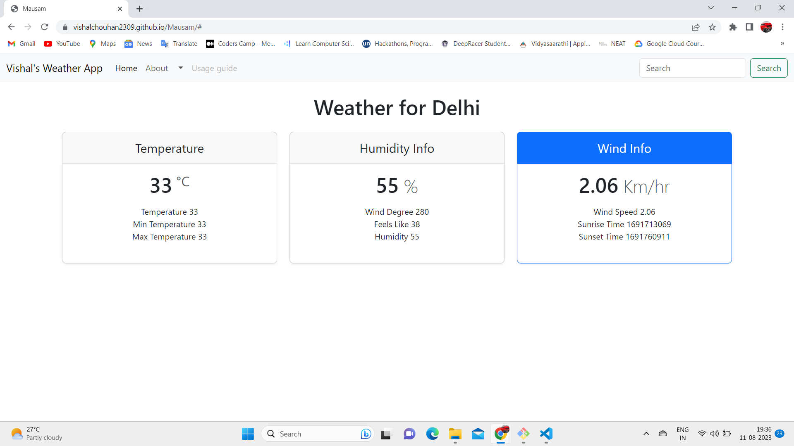

# Mausam - Weather analysis and prediction


## About

In today's fast-paced world, staying informed about the weather is essential for planning our daily activities, from outdoor adventures to business meetings. Mausam is a cutting-edge weather prediction webapp designed to provide users with accurate and up-to-date weather forecasts, personalized insights, and real-time updates. With a user-friendly interface and advanced features, Mausam is the go-to app for anyone who wants to stay ahead of the weather.

Mausam is a valuable tool for staying informed about the weather and planning your activities accordingly. By using Mausam you can stay safe and comfortable, no matter what the weather brings. It provides up-to-date weather information for your current location or any other location in the world. It typically offer a variety of features, such as:


```bash
Current weather conditions, including temperature, humidity and wind speed 

```

## Attributes

```
Temperature
min temperature
max temperature

Humidity info
wind degree
feels like 
Humidity

Wind info
Wind speed

```

## Weather api used https://rapidapi.com/apininjas/api/weather-by-api-ninjas/
Get the latest weather data for any region in the world
The API Ninjas Weather API provides the latest weather information for any city or geographic location in the world.

# Screenshot of UI


# YouTube Video Link
Link for YouTube Video https://youtu.be/mLCwkXIQ2Vs


## Deployment
# azure web app link : https://proud-glacier-0f8de4810.3.azurestaticapps.net
# Github pages link  : https://vishalchouhan2309.github.io/Mausam/
